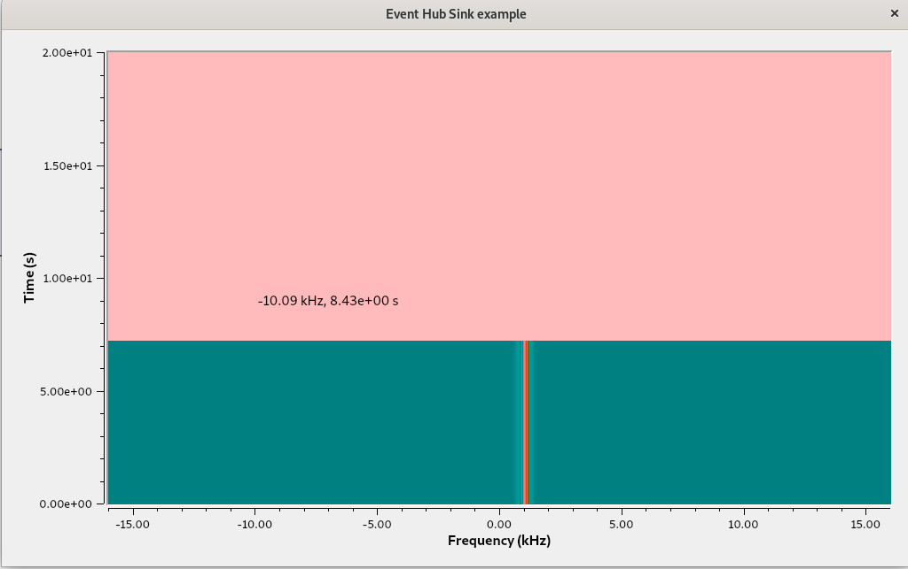
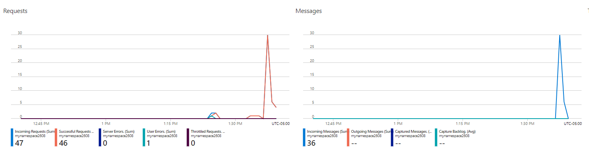
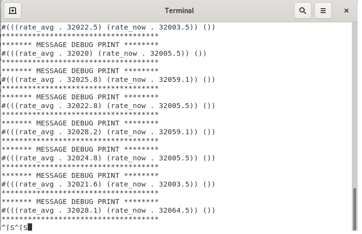

# Quickstart: Using Azure Event Hubs in GNU Radio

The Event Hub blocks provide an interface to send and receive events to [Azure Event Hubs](https://docs.microsoft.com/en-us/azure/event-hubs/event-hubs-about) using the message passing interface in GNU Radio.  In this quickstart we walk through examamples of both of these blocks.

## Prerequisites

- Install GNU Radio runtime, GNU Radio Companion, and the Azure Software Radio Out-of-Tree module. See the
[Azure Software Radio: Getting Started](../README.md#getting-started) section for more details.

## Setting Up an Event Hub in Azure

To run the examples in this tutorial you must first create an Event Hub namespace, an Event Hub, and a consumer group. To deploy these resources using our premade ARM templates, click the 'Deploy to Azure' button.  Alternatively, you can create the resources manually using the instructions below.

(Choose One)

1. Deploy Resources Automatically

    1. Click <a href="https://portal.azure.com/#create/Microsoft.Template/uri/https%3A%2F%2Fraw.githubusercontent.com%2Fmicrosoft%2Fazure-software-radio%2Fdocumentation%2Fcli-updates%2Fgr-azure-software-radio%2Fexamples%2Fevent_hub_example_resources.json" target="_blank"></a>
    2. You will have to pick a new or existing resource group to assign the new resources to
    3. Change namespace to be unique (e.g., add your favorite 5 digit number to the end)
    4. For the rest of the parameters you can leave the defaults or fill in your own names

2. Deploy Resources Manually

    1. Create an Event Hub in your Azure subscription, see [Create an Event Hub](https://docs.microsoft.com/en-us/azure/event-hubs/event-hubs-create) for instructions.
    2. Create a Consumer Group within the newly created Event Hub, see [Create an Event Hub Consumer Group](https://docs.microsoft.com/en-us/cli/azure/eventhubs/eventhub/consumer-group?view=azure-cli-latest).
    3. Choose how to authenticate to the Azure Event Hub. This tutorial uses the "connection string" authentication option.  See [Get an Event Hub Connection String](https://docs.microsoft.com/en-us/azure/event-hubs/event-hubs-get-connection-string) for instructions on how to obtain a connection string associated with your newly created Event Hub.

Next, remote desktop into your VM.  If you plan to use the Azure CLI to authenticate to the back end, please run

```bash
az login
```

Then launch GNU Radio Companion from the same terminal using:

```bash
gnuradio-companion
```

This will ensure your authentication tokens are available when running the flowgraph. 

----
## Run the Event Hub Sink Example

Open the [eventhub_sink_example.grc](../examples/eventhub_sink_example.grc) flowgraph within GNU Radio. Before running the flowgraph you must:
1. Change the __connection_str__ variable to use your connection string (see the instructions on how to [Get an Event Hubs connection string](https://docs.microsoft.com/en-us/azure/event-hubs/event-hubs-get-connection-string) for more details).  Replace the entire Value with your string, then add single quotes to each side.
2. Change the __eventhub_name__ variable to use the event hub entity you created as part of the [Event Hub Prerequisites section above](#event-hub-example-prerequisites) (e.g., myeventhub) with single quotes around it.

Run the flowgraph for a few seconds and then close it, either by closing the window or using the stop button.  You will know the flowgraph works if you see a similar window pop up:

<center></center>

Navigate to your event hub in the Azure portal and you should see the events in the __Overview__ blade.  Depending on how long you left the flowgraph running, you should see event activity in the chart:

<center></center>

What this flowgraph is doing is simulating a sine wave, displaying it with the QT GUI Waterfall Sink, and the Probe Rate block is outputting messages containing the rate samples are flowing into it (the messages are created at the specified update rate and the contents of the message contain the rate samples are flowing).  Each message coming out of this Probe Rate block is then sent to your Azure event hub using the Event Hub Sink block.  In the next part we will pull these messages from Azure back into GNU Radio and display them.

----
## Run the Event Hub Source Example

Note, this example requires having already run the Sink example above, so that your event hub has content in it.

Open the [eventhub_source_example.grc](../examples/eventhub_source_example.grc) flowgraph within GNU Radio. Before running the flowgraph you must:

1. Change the __connection_str__ variable to use your connection string (see the instructions on how to [Get an Event Hubs connection string](https://docs.microsoft.com/en-us/azure/event-hubs/event-hubs-get-connection-string) for more details).  Replace the entire Value with your string, then add single quotes to each side.
2. Change the __eventhub_name__ variable to use the event hub entity you created as part of the [Event Hub Prerequisites section above](#event-hub-example-prerequisites) (e.g., myeventhub) with single quotes around it.
3. Change the consumer_grp variable to use consumer group name created as part of the [Event Hub Prerequisites section above](#event-hub-example-prerequisites) (e.g., myconsumergroup) with single quotes around it.

Run the flowgraph and you should see the Message Debug block showing the contents of the received events:

<center></center>

The flowgraph grabs the messages that were sent to your event hub in the previous example, and then displays them in a terminal.  You will notice they all show up immediately, and then nothing else happens, because it reached the end of the list of messages in event hub.

Once you are done with running the examples, delete the resources you created to ensure you do not incur ongoing charges for storage.

----
## Recommended content

### [Azure Event Hubs](https://docs.microsoft.com/en-us/azure/event-hubs/event-hubs-about)


