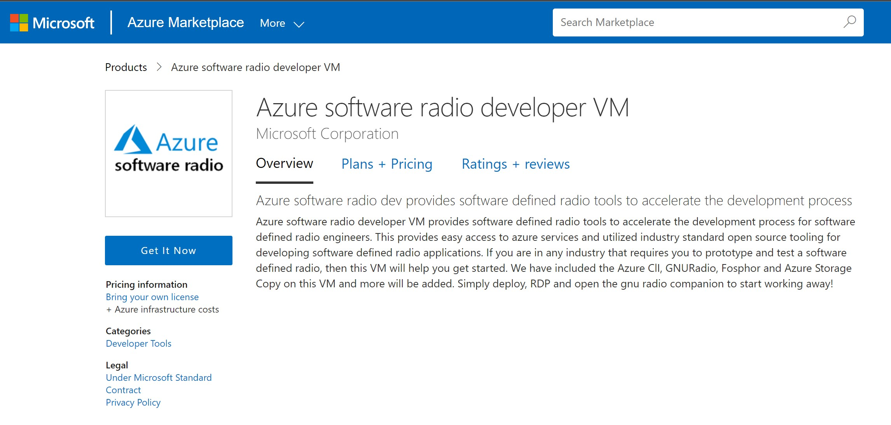
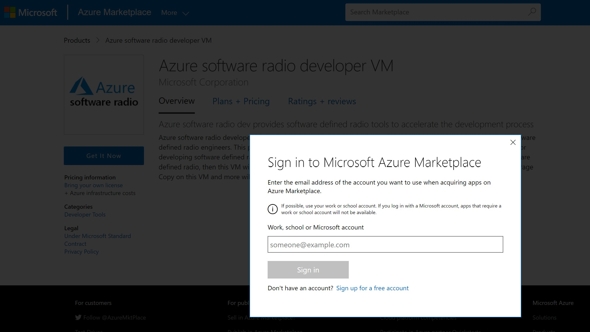
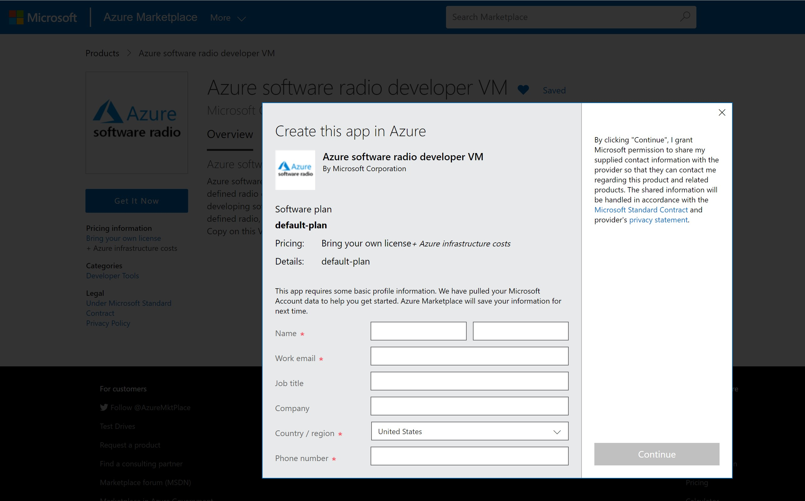
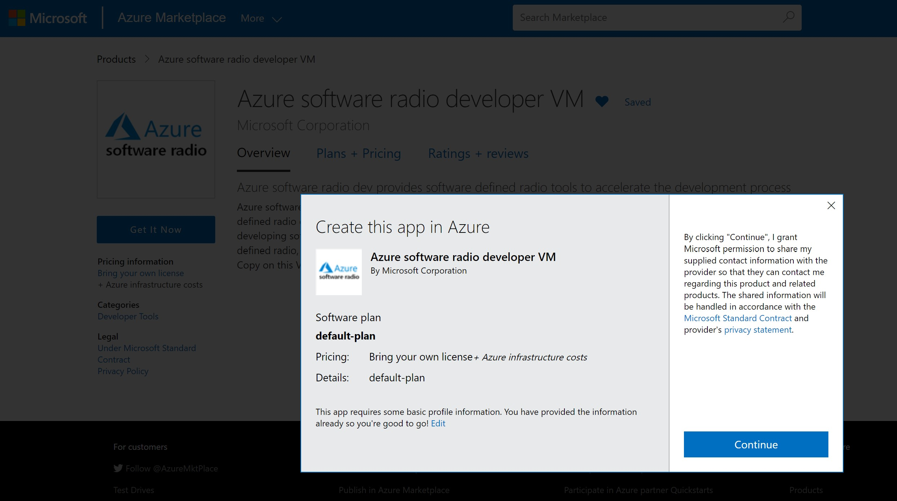

# Welcome To Azure software radio developer VM

The Azure software radio developer VM is the start of major investments by the Azure Spectrum Team to facilitate software defined radio development on Azure. This will accelerate development of SDR applications and harness the power of Azure to expand potential opportunities in this industry.

To launch our first set of offerings we have built a developer VM on Ubuntu 20.04 which is ready to go with the most common tools for developing SDR. These include

1. GNU Radio
2. Fosphor
3. [gr-azure](https://github.com/microsoft/gr-azure)
4. [gr-difi](https://github.com/difi-consortium/gr-difi)

We have also included Azure Native Tools including
1. Azure CLI
2. Azure Storage Copy (AzCopy)

Once you deploy the virtual machine simply RDP/VNC to the machine and get developing!

The VM is deployed into a self-contained resource group, virtual network and public ip address.
You should take additional steps to secure the public IP address to only allow connections from trusted IP's.

If you have any feedback simply log an issue on this GitHub repo or get in touch with the team via email at azuresoftwareradio@microsoft.com

## Accessing the Developer VM in the Azure Marketplace

1. Find the developer VM in the [Azure Marketplace](https://azuremarketplace.microsoft.com/en-us/marketplace/apps/microsoftcorporation1620407702632.az-spectrum-gnu-radio-dev?tab=Overview)
2. Click on "Get It Now"
   

3. Sign-in into the Marketplace and fill out your info to get access to the public preview
   
   
   
4. [Create and deploy the VM](#deployment-of-the-azure-software-radio-developer-vm)

## Validate Quota Requirements

1. From the Azure Portal Click Subscriptions

   

2. Locate and Click your subscription

   

3. Click Usage & Quotas

   

4. Type NV in the search bar and verify as shown that you have sufficient quota (at least 12 free cores) for the region you want to deploy into.  We recommend using the region with the lowest latency, which you can easily determine using [this web app](https://azurespeedtest.azurewebsites.net/).

   

5. if you do not have enough quota, click the pencil (edit) icon and request more cores and ensure it is successful before attempting to deploy the development VM.

## Deployment of the Azure software radio developer VM

1. Click Create to begin the VM creation

   

2. On the Create VM Page 1, select the subscription which has been authorized for developer VM and allow for a dynamic resource group to be created or select an existing one. Enter a Name for the virtual machine, select the same region to which you have applied and have available quota.  Change Availability options to "No infrastructure redundancy required" (this is needed to be able to use the NV series VMs).  Under Size you should now be able to choose an NV series.  For Authentication type we recommend using a password, so that it will be easier to use RDP into the VM.  Click Next: Disks

   

3. Click Next: Networking and Review Settings nothing needs to be changed
4. Click Next: Management and Review Settings
5. Click the checkbox for System Managed Identity and Click Next: Advanced

   

    **The System Managed Identity can be assigned permissions to Azure Resources Post Deployment to allow the Azure Client and AzCopy to login directly to Azure and access resources it has been authorized to**

6. Click Review+Create and then Click Create
7. Confirm the deployment is successful as shown and click Go To Resource

   

## Connect to the Developer VM

1. On the VM resource page record the Public IP Address

   

2. Start your favorite RDP client enter the IP Address and logon with the credentials set during deployment
