# Mapping Airplane Locations Using ADS-B and Power BI

This tutorial is split into two parts.  First, we will show how ADS-B signals can be decoded and sent to Azure event hub.  Next, we incorporate Power BI to plot the locations of aircraft over time on a map-based interface. 

## Prerequisites

- As part of the second half of this stage you will need a Power BI account and access to at least one [Power BI Workspace](https://docs.microsoft.com/en-us/power-bi/collaborate-share/service-create-the-new-workspaces).  Depending on your account you may be able to simply go to https://msit.powerbi.com and sign in.

## Introduction

Automatic Dependent Surveillance-Broadcast (ADS-B) is a wireless technology used by aircraft to broadcast their position and other onboard sensor data. The information can be received by air traffic control ground stations, as well as other aircraft, to provide situational awareness. ADS-B is automatic, i.e., it requires no pilot input. The data sent over ADS-B originates from the aircraft's navigation system and other sensors.  The signal is transmitted at 1090 MHz, uses pulse position modulation (PPM), and has a bandwidth around 50 kHz (it's a very low data rate signal).

<center></center>

For those who skipped the manual installation of GNU Radio steps, this will be the first time installing a GNU Radio out-of-tree module (OOT) from source.  OOTs are an important part of GNU Radio, as GNU Radio only comes with a basic set of signal processing blocks, and most application-specific blocks are found in 3rd party OOTs.  In addition, if you build your own GNU Radio application, there is a good chance you will want to create your own OOT to contain the custom blocks created.  Most OOTs are installed using the same set of steps, although some have unique dependencies.

If you haven't cloned a copy of these Tutorials to the VM yet, open a terminal in the VM and run the following:

```console
git clone https://github.com/microsoft/azure-software-radio-hello-world.git
```

## Installing the gr-adsb Out-of-Tree Module

The process of installing the **gr-adsb** OOT module onto a system with GNU Radio already installed is as follows.  Open a terminal and type:
```console
git clone https://github.com/mhostetter/gr-adsb.git
cd gr-adsb
mkdir build
cd build
cmake ..
make
sudo make install
sudo ldconfig
```

This process is the same for most GNU Radio OOTs, you simply replace the github url with whichever OOT you are trying to install.  If you are curious what other OOTs exist publicly, check out [CGRAN](https://www.cgran.org/) which is an online index of GNU Radio OOTs.  Note that some OOTs have dependencies beyond what GNU Radio depends on, and may have an extra `apt install` step.  You will know the installation of gr-adsb was successful because additional ADS-B blocks will be available in GNU Radio as shown in the red box highlighted below:

<center>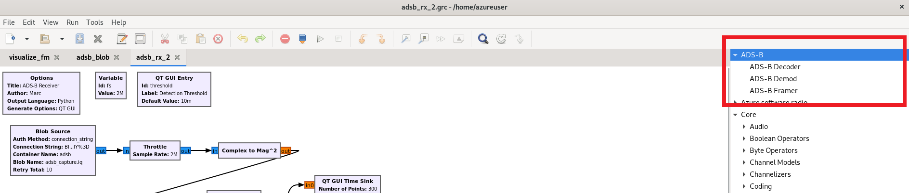</center>

## ADS-B and Event Hub

Open GRC, but this time, launch it by opening Ubuntu's Terminal application and typing in: `gnuradio-companion`. The **gr-adsb** module will print out additional information in this Terminal window while it is running. Now, open the flowgraph [adsb_event_hub.grc](flowgraphs/adsb_event_hub.grc) which is in the adsb_powerbi/flowgraphs directory within this repo.  You should see the following flowgraph (ignore the grayed out Event Hub Sink block):

<center>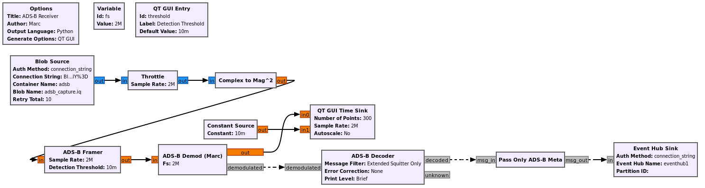</center>

The first block, which is where the samples originate from, is the same Blob Source we used in Stage 1, but this time we are pulling down an RF recording that contains a capture of ADS-B, taken in the DC area.  The signal is converted from complex samples to magnitude squared (power); due to the nature of PPM modulation we only need the power over time.  The ADS-B Framer/Demod/Decoder blocks work together to demodulate and decode the signal, we will not be diving into the details of how they work in this stage, but you can refer to [this tutorial](https://wiki.analog.com/resources/eval/user-guides/picozed_sdr/tutorials/adsb) for more information. 

The grey input/output ports represent messages instead of a stream of samples.  The connections use a dashed line to represent the fact they are asynchronous with respect to the samples flowing through the flowgraph.  In other words, the output of the Demod block goes to a Time Sink for visualization purposes, but the actual demodulated data is sent out over a message and is no longer aligned to sample time.  It turns out the Demod block sends the raw bits along with the metadata, so the Pass Only ADS-B Meta block is used to get rid of the raw bits because we don't want them sent to Event Hub, we only want the metadata.  The metadata, stored within the message, arrives at the Event Hub Sink block and the block converts it from a GNU Radio message to JSON, and sends it to an Event Hub endpoint.  In the second part of this tutorial we will actually process this data sent over Event Hub.

When you run the flowgraph you should see the following output:

<center>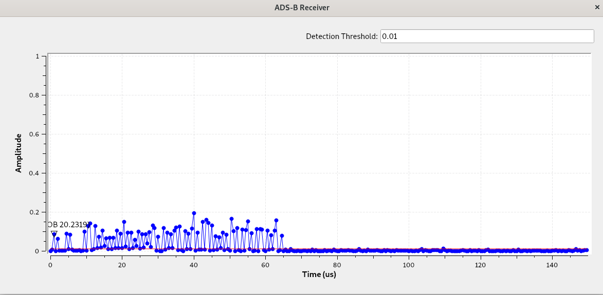</center>

This shows the signal over time, and the display is triggering in such a way that the beginning of each packet is aligned to the left side of the plot.  So we can see that this particular packet was roughly 65 microseconds in duration, but you will notice that there are packets of various length.

If you switch windows and bring up the Terminal window you used to launch GRC, you might see a list of decoded messages (in some installations this will *not* show up in your terminal, but instead you will see less structured output in the bottom-left GRC console):

```
  Time    ICAO  Callsign  Alt  Climb Speed Hdng   Latitude    Longitude  Msgs
                            ft  ft/m    kt   deg         deg         deg     
76:06:02 a46ab3 FFT2380  20775 -1728   425    15  38.7591705 -76.4883688   24
86:06:02 aa7e74          30000 -1024   507    56  38.6728060 -76.6093750   17
16:06:02 ab6394           5875  -128   237   179  38.9737663 -76.9388428    8
16:06:02 a609d4          36025   -64   514    25  38.4288025 -76.7635644    4
16:06:02 a95a1c          19000     0   393  -108  38.5884247 -76.6375799    8
16:06:02 a9b088 AAL966    6175 -1920   252   123  38.7975660 -77.0895386    6
66:06:02 a9f4c6          35000    64   476    48  38.5527191 -76.9266875    5
```

This is actually the data from the aircraft, which provides the aircraft location and heading, along with some identifying information. While this is useful for navigation systems, humans prefer to have this visualized and that is where Event Hub and Power BI come in. 

## Power BI and Maps Interface

<center></center>

[Azure Event Hub](https://azure.microsoft.com/en-us/services/event-hubs/) is a real-time data ingestion service. We will be using it to receive and visualize the ADS-B data that our GNU Radio flowgraph is generating. [Power BI](https://powerbi.microsoft.com/en-us/) makes it easy to build visualizations of your data and there is a [version](https://powerbi.com/) you can use in your browser. To connect Event Hubs to Power BI, we will be using the [Azure Stream Analytics](https://azure.microsoft.com/en-us/services/stream-analytics/) service which makes it easy to build data pipelines.

### Event Hubs

The first step is to create a new Event Hub. There is documentation for doing so using the [Azure Portal](https://docs.microsoft.com/en-us/azure/event-hubs/event-hubs-create) or the [Azure CLI](https://docs.microsoft.com/en-us/azure/event-hubs/event-hubs-quickstart-cli).  Make sure to create both an Event Hubs namespace and an Event Hub under that namespace.

**Note:** When creating the Event Hubs Namespace, set the **Pricing Tier** to **Standard** and set the **Throughput Units** to **1**.

After you have completed this, your new Event Hub should be listed in the Resource Group you are using. You now need to get the Connection String of the Event Hub instance (not the namespace) for it so the flowgraph can send messages to the Event Hub. Follow [these steps](https://docs.microsoft.com/en-us/azure/event-hubs/event-hubs-get-connection-string) to get the Connection String and copy it to your clipboard. 

Now return to the GRC window and find the Event Hub Sink block in the far right side of the flowgraph.

<center></center>
 
Double click it to bring up the properties for the block. Select **connection_string** for the Auth Method and paste in the Connection String in the appropriate field. Enter the name of the Event Hub instance you created (not the namespace) in the Event Hub Name field. Now enable the Event Hub Sink block and run the flowgraph again, you can continue to the next step while it runs. 
 
 <center>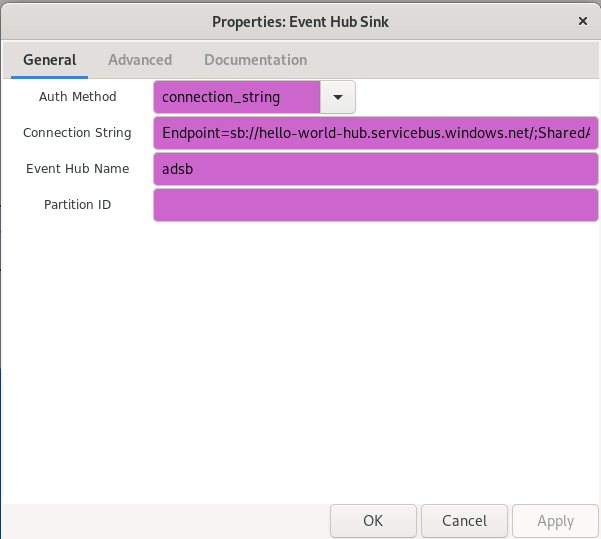</center>
 
 If you go to the Azure Portal and navigate to your Event Hub instance, you should start to see the graphs show that messages are being received from the flowgraph, note that it may take a minute to update. If you don't see messages arrive then re-run the flowgraph and refresh the page.  Once message activity is seen, you can stop the flowgraph by closing the window that opened when it started.

 <center>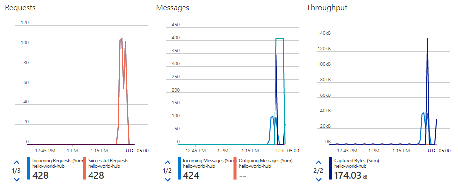</center>

 ## Stream Analytics

 Now that we have the ADS-B output in Azure, it is time to make it more accessible. Azure Stream Analytics makes it easy to connect services and applications to the streaming data coming from Event Hub. 

### Create a Job

 Follow these steps to create a Stream Analytics Job:
 1. Sign into the Azure portal
 2. Select **Create a resource** in the upper left-hand corner of the Azure portal
 3. Select **Analytics > Stream Analytics job** from the results list
 4. Fill out the Stream Analytics job page with the following information:


|Setting	|Suggested value	|Description|
|-----------|-------------------|-----------|
|Job name	|ADSB-Job	|Enter a name to identify your Stream Analytics job. Stream Analytics job name can contain alphanumeric characters, hyphens, and underscores only and it must be between 3 and 63 characters long.|
|Subscription|	\<Your subscription\>	|Select the Azure subscription that you want to use for this job.|
|Resource group|	\<Same as the Event Hub\>|	Select the same resource group as your Event Hub.|
|Location	|\<Select a nearby region\>|	Select geographic location where you can host your Stream Analytics job. Use the location that's closest to your users for better performance and to reduce the data transfer cost.|
Streaming units|	1	|Streaming units represent the computing resources that are required to execute a job. By default, this value is set to 3. To learn about scaling streaming units, refer to understanding and adjusting streaming units article.|
|Hosting environment|	Cloud	|Stream Analytics jobs can be deployed to cloud or edge. Cloud allows you to deploy to Azure Cloud, and Edge allows you to deploy to an IoT Edge device.|

 <center>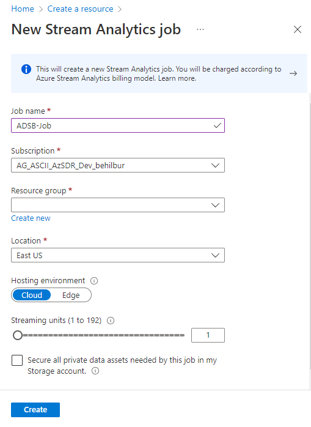</center>

 5. Click **Create**
 
 At this point you should see a "Deployment in progress..." notification displayed in the top right of your browser window.

### Add an Input

Once the deployment has completed, navigate to your Stream Analytics job and follow these steps:

1. Select **Inputs > Add Stream input > Event Hub**
2. Fill out the Event Hub page with the following values:

|Setting	|Suggested value	|Description|
|-----------|-------------------|-----------|
|Input alias	|Event-Hub-Input	|Enter a name to identify the job's input.|
|Subscription	| \<Your subscription\>	|Select the Azure subscription that has the Event Hub you created.|
|Event hub namespace|		|Select the event hub namespace you created previously section. All the event hub namespaces available in your current subscription are listed in the dropdown.|
|Event Hub name|	|Select the event hub you created previously. All the event hubs available in your current subscription are listed in the dropdown.|
|Event Hub consumer group| \<Create new\>| Create a new event hub consumer group for this Streams Analytic job|
|Authentication mode| \<Connection String\>| This will automatically copy over the connection string from the Event Hub you selected.|
|Event Hub Policy name| Use Existing | Select the event hub instance policy name.|

3. Leave other options to default values and select **Save** to save the settings

### Add an Output

Now it is time to create an output destination for the job:

1. Select **Outputs > Add > Power BI**

2. Fill out the Power Bi (New output) page with the following values:

|Setting	|Suggested value	|Description|
|-----------|-------------------|-----------|
|Output alias|	PowerBI-Output	|Enter a name to identify the job's output.|
|Group Workspace	|\<Your Power BI Group workspace\>	| Select the Power BI Group workspace that is associated with the Microsoft account you are logged in under and you wish to use. For creating a new workspace see [creating a Power BI workspace](https://docs.microsoft.com/en-us/power-bi/collaborate-share/service-create-the-new-workspaces). |
|Authentication Mode| User Token | Stores a User Token to authenticate with Power BI|
|Dataset name| \<Your dataset name\> | This is the name of the dataset that will be created in Power BI.|
|Table name| adsb | This is the name of the table that will be created in the dataset.|


3. Leave other options to default values and click the large, blue **Authorize** button. You will then authenticate to Power BI, which will generate a User Token for this Job.

4. Finally, select **Save** to save the settings

### Add a Query

Finally, the transformation query allows you to select which data goes to which output. For this example, we will be sending all of the data to the output:

1. Select **Query** from the Job topology Resource Menu and update the query as follows. (*If you used different names for the Input and Output, use those instead*):
```SQL
SELECT *
INTO [PowerBI-Output]
FROM [Event-Hub-Input]
```
2. The query reads the data from Event Hub and streams it to Power BI. Select **Save query**

### Start the job

Everything should now be configured for your Stream Analytics job. The next step is to start the job. Go back to the Overview screen for the Job and Click the **Start** button in the upper left hand corner. This will bring up a blade providing you information about the job. Click the **Start** button on this blade. You should receive a notification that the process has started.

## Power BI

The final step is to create a Dashboard in Power BI to help visualize the data. Before getting started, run the flowgraph one more time, this will ensure that ADS-B data flows through the Event Hub and triggers Stream Analytics to create the Dataset in Power BI.  The flowgraph will run forever, but after roughly 3 minutes the activity will end and you can stop the flowgraph by closing the window (feel free to work on the next steps while it runs). 

Go to [Power BI](https://powerbi.com) and **Sign In**.  The following steps will show you how to create the map-based interface.

1. Select the Workspace you designated in your Stream Analytics job; you should see your Dataset listed in the Workspace:
 <center>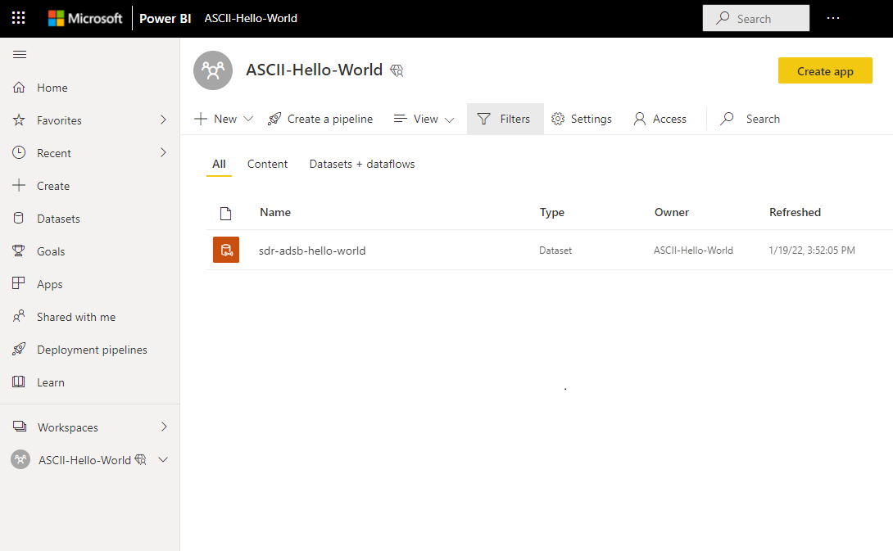</center>

2. Now create a new report, by clicking on **New** in the upper left corner and selecting **Report**:
 <center>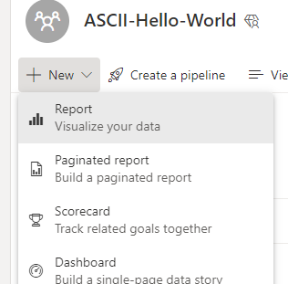</center>

3. Click **Pick a published dataset** and select the dataset from your Workspace

4. Now it is time to build your report! Click on the **Map** icon to add a map for visualizing the planes locations and resize it to fill the top half of the report

5. From the **Fields** column, drag the **latitude** key over into the **Latitude** field for the map visualization and do the same for longitude, then drag the **icao** key into the **Legend** field

You should now see a map with the different planes' locations being plotted over time:

 <center>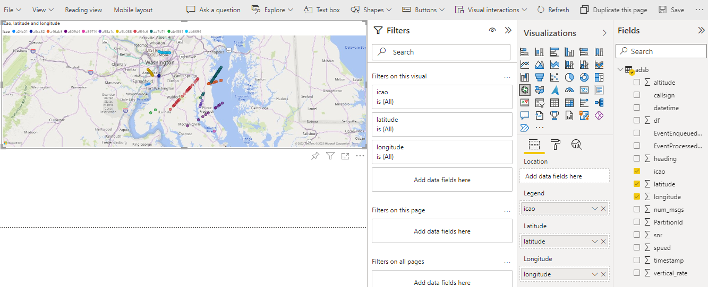</center>

Now let's add a graph of the planes' altitudes. 

6. Unselect the Map visualization and click on the Line Chart icon to add it and resize it fill the bottom left quarter of the report

7. Now, drag the **timestamp** key from the Dataset over to the **Axis**, the **altitude** key over to the **Values** field and the **icao** key over to the **Legend** field

You should now see a chart of the different planes' altitude over time:

 <center>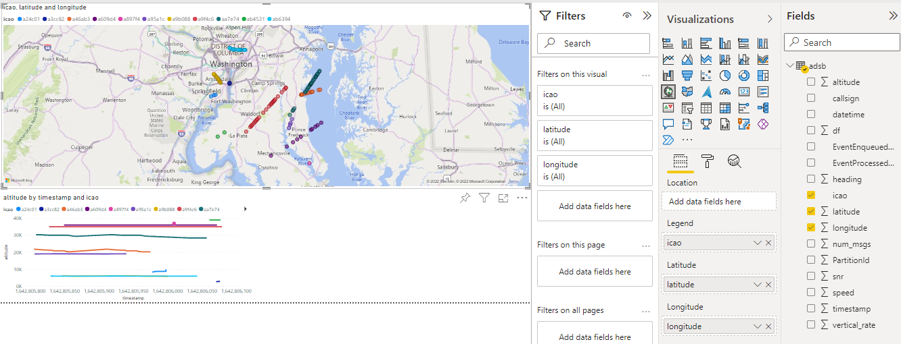</center>

Finally, let's add a graph of the planes' speed. 

8. Unselect the altitude chart and click on the Line Chart icon to add it. Resize it fill the bottom right quarter of the report

9. Now, drag the **timestamp** key from the Dataset over to the **Axis**, the **speed** key over to the **Values** field and the **icao** key over to the **Legend** field

 <center>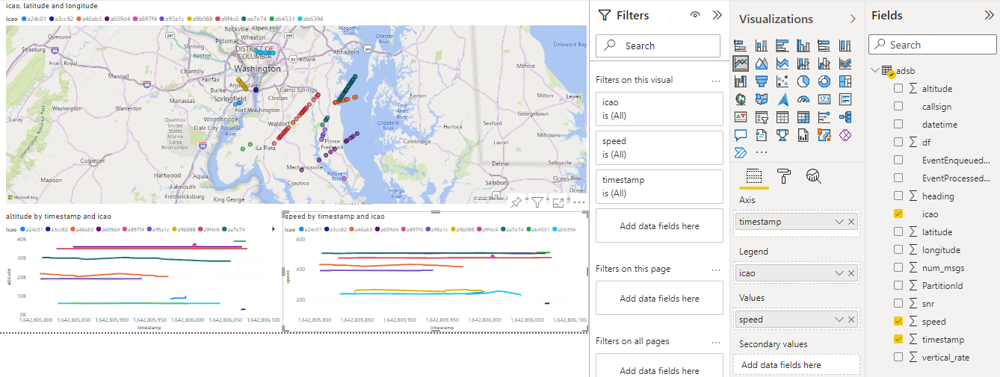</center>


 ### Congratulations!

 If all went well, you should have successfully gone from pre-collected RF data to an information rich visualization.  This system could easily be used for a live capture of RF signals, by substituting the Blob Source with an SDR (even a $20 RTL-SDR).  Hopefully this help illustrate how Azure and streaming pipelines that can transform your data and help you better understand it!

  <center>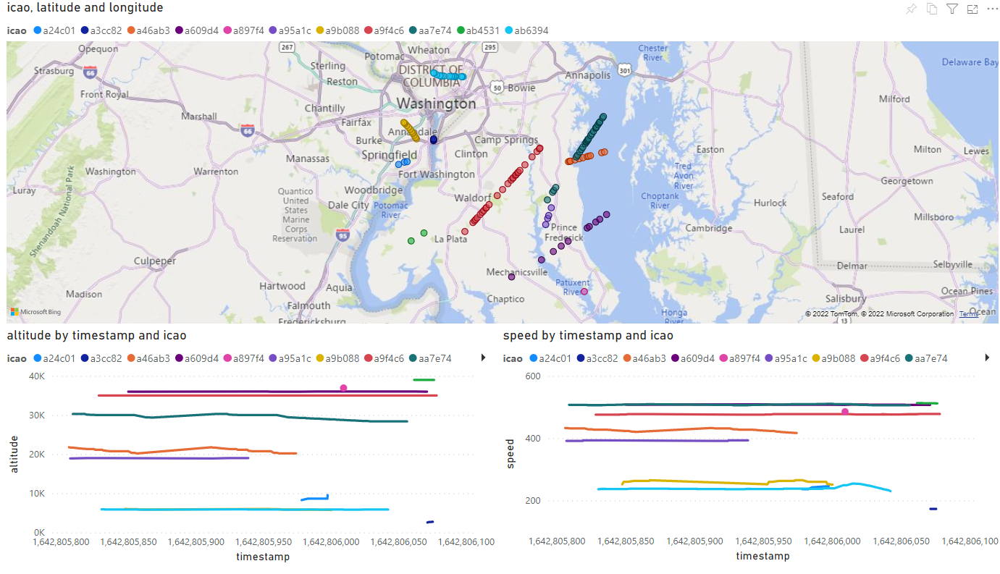</center>

