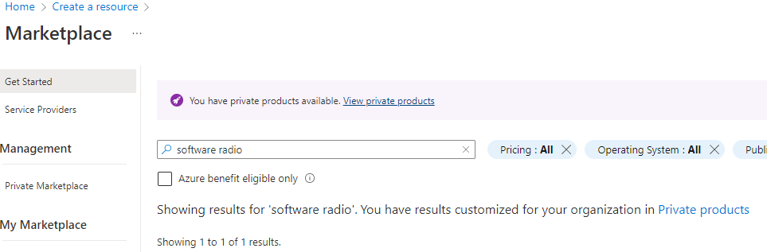
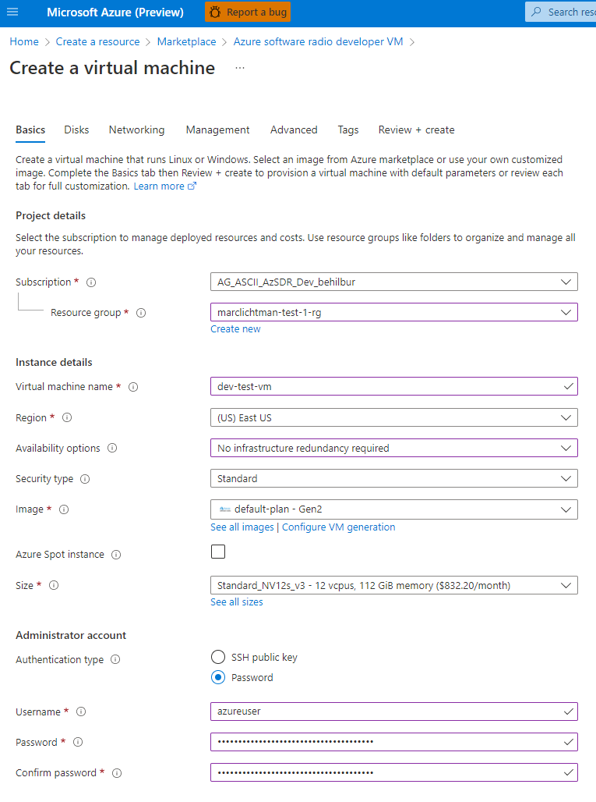
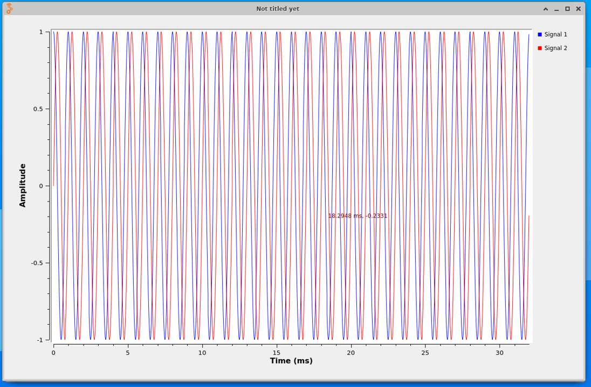
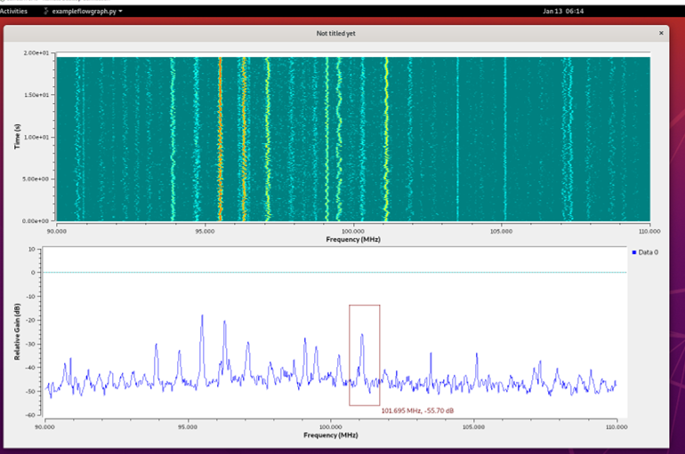
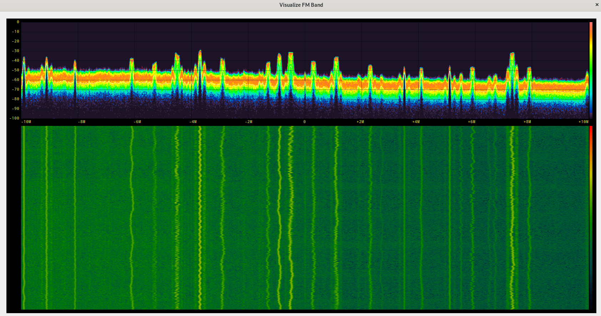
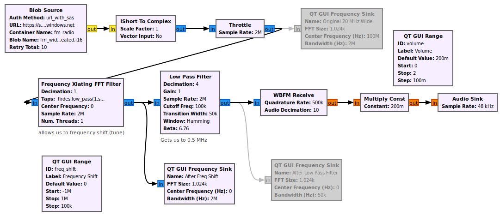

# Exploring GNU Radio Companion

GNU Radio is a free & open-source software development toolkit that provides signal processing blocks to implement software-defined radios (SDRs). It can be used with readily-available RF hardware, or without hardware in a simulation-like environment. It is widely used in research, industry, academia, government, and hobbyist environments to support both wireless communications research and real-world radio systems.  Using a framework like GNU Radio to create applications makes it easy to share your application with others.

<center></center>

Throughout the chapters of this tutorial we will show examples of performing SDR in the cloud, using Azure. To get started, we offer two different methods of setting up the Ubuntu based GNU Radio environment:

1. Using our Azure software radio development VM in Azure Marketplace (recommended, simply continue below for this option)
2. Starting from a fresh Ubuntu 20 VM [using these steps](vm_from_scratch.md)

By using our preconfigured development VM, not only are you skipping several install steps, but you are also getting a VM that already has audio passthrough configured (e.g., for listening to a demodulated audio signal), as well as GPU support for applications like gr-fosphor.

## Using Azure Software Radio Development VM

### Signing up for the Private Preview of the Azure software radio developer VM

Currently the Azure software radio developer VM is in Private Preview and our team must first authorize you to be able to deploy the service.  To sign up for the Developer VM click [Here](https://forms.office.com/r/sbZqBUVUE0), fill in the required details and our team will ensure you get authorized within 24 hours for the service.  The next step will verify you have access.

### Deployment of the Azure software radio developer VM

We will now check if you have access to the developer VM.  If at any point below you run into trouble and need more detailed instructions, reference [this guide](https://github.com/microsoft/azure-software-radio/blob/documentation/cli-updates/pages/devvm.md).

1. Open your browser and navigate to [Azure Portal](https://portal.azure.com) and sign-in.
2. Click "Create a Resource" with the large plus sign.
3. Type "software radio" in the search box, hit enter, and you should see the purple message "You have private products available" show up, as seen in the screenshot below.  Click View private products.
   
   

4. If access has been approved the Marketplace will include "Azure software radio developer VM", click it and click Create.  Note, if you see two versions of the Azure software radio developer VM, do not select the offer marked preview, select the normal one.  If you don't see any listed and it has been more than 48 hours since you filled out the form, contact the Azure software radio developer VM team via email at azuresoftwareradio@microsoft.com.

5. On the Create VM Page:
   - Select the subscription which has been authorized for developer VM
   - Select a new or existing resource group
   - Enter a Name for the virtual machine
   - Select your preferred region; we recommend using the region with the lowest latency, which you can easily determine using [this web app](https://azurespeedtest.azurewebsites.net/)
   - Change Availability options to "No infrastructure redundancy required" (this is needed to be able to use the NV series VMs)
   - Under Size click "see all sizes", choose an NV series if one is available in your region (if not, try using the next lowest latency region).  NV series VMs have a GPU and are specifically designed for desktop accelerated applications and virtual desktops.  If you are using a trial Azure subscription and don't have access to NV series VMs, that's OK, we do not require a GPU for any of the steps in this tutorial. The [Dv2 series](https://docs.microsoft.com/en-us/azure/virtual-machines/dv2-dsv2-series) is a good substitute for this tutorial if NV is not available.
   - For Authentication type, choose Password, as it will be needed to RDP into the VM
   - The first page should look similar to the screenshot below
   
   

6. Towards the top click the Management tab, and click the checkbox for System Managed Identity
7. Click Review + Create at the bottom, then click Create
8. After a few minutes it should say "Your Deployment is Complete", click the Go to resource button
9. On the VM resource page, record the Public IP Address shown on the right side
10. Start your favorite RDP client and enter the IP Address and user+password chosen during deployment

At this point you should be in the desktop of your VM, and all instructions will be done within the VM unless otherwise stated.   If you ran into any issues above, please reference [this guide](https://github.com/microsoft/azure-software-radio/blob/documentation/cli-updates/pages/devvm.md).

## Reducing Graphic Latency of Remote Desktop

This section is optional, and provides a few tweaks to improve the remote desktop user experience.

1. Open a terminal within the VM (e.g., by clicking the top left corner, then typing "terminal") and type `gsettings set org.gnome.desktop.interface enable-animations false`
2. `sudo reboot`, the RDP session will close
3. Before logging back into the VM again, in your Remote Desktop Connection settings click Show Options
4. Go to the Display tab, and use a 1920 x 1080 pixels or lower resolution
5. Go to the Experience tab, then choose "Modem (56 kbps)" which will turn off a bunch of visual features that we don't need 
6. Connect to the VM
7. Open a terminal within the VM and run `sudo apt-get install gnome-tweak-tool`
8. Open the tool using `gnome-tweaks`
9. In the GUI, go to the Extensions tab, and enable all three toggles, then close the tool

You should now find the desktop experience a lot snappier.

## Running GNU Radio

Before you get started, lets clone a copy of these Tutorials to the VM. Open a terminal in the VM and run the following:

```console
git clone https://github.com/microsoft/azure-software-radio-hello-world.git
```

To actually use GNU Radio, you must open up GNU Radio Companion (GRC) in a new terminal.  GRC is the graphical interface or front-end for GNU Radio.  You can either search for the app in Ubuntu app drawer, or open a terminal and type:
```console
gnuradio-companion
```

<center></center>

A window should pop up running GRC.  Note the blocks available on the right panel, they are all under the Core category, which means they come with GNU Radio. Soon we'll add the Azure blocks and you'll see a new category.

<center></center>

The main window is called the canvas, and it's where we will build our flowgraph.  A flowgraph is a connection of blocks through which a continuous stream of samples flows. The concept of a flowgraph is an acyclic directional graph with one or more source blocks (to insert samples into the flowgraph), and one or more sink blocks (to visualize or export samples from the flowgraph), and any signal processing blocks in between.

To create our first flowgraph, start by clicking the magnifying glass towards the top-right, and in the search box begin to type `Signal Source`; when you see it come up (it's under the Waveform Generators) category, 
either double click it or drag it to the left, in order to add it to the canvas.  Repeat this process to add a **Throttle** block and **QT GUI Time Sink** block.

<center></center>

The **Signal Source** block will generate a simulated signal for us to visualize with the **QT GUI Time Sink** block, which will show us the time domain of that signal.  Because there is no hardware (e.g. SDRs) involved in this flowgraph, we need to add a **Throttle** block to prevent the **Signal Source** from generating samples as fast as the CPU allows.  

Now we must connect the blocks.  The blue ports represent the blocks inputs and outputs.  You can click on the output of one, then click on the input of another, to connect them.
The blocks should change from red to blank indicating there are no errors.  

<center></center>

However, there is still an error in the Options block, because we haven't set the ID of our flowgraph.

Double click the **Options** block, and change the ID parameter to whatever you want (e.g., my_first_flowgraph).  Next save the flowgraph wherever you want, e.g. my_first_flowgraph.grc.
Now hit the play button.  You may see a warning message pop up, this only happens once and can be ignored, just hit OK. 

<center></center>

You should see two sine waves, Try zooming in by dragging a rectangle inside the plot window.  When you are done visualizing the signal, close the plot window.

<center></center>

You may have noticed there were two sine waves, that's because we were simulating a complex sinusoid which has a real and imaginary part.  For now let's simplify things 
and simulate a real sine wave (if you want to learn more about complex signals, we recommend [this tutorial](https://wiki.gnuradio.org/index.php?title=IQ_Complex_Tutorial)).  Open each of the three blocks (double click) and change Type from complex to float.  You'll notice the input/output ports go from blue to orange.
Now run the flowgraph and you'll see just a single sine wave.  Close the plot, and try changing the **Signal Source**'s frequency from 1000 to 100, and run the flowgraph to see how it changes.

<center></center>

As a reference, the completed flowgraph can be found in [flowgraphs/my_first_flowgraph.grc](./flowgraphs/my_first_flowgraph.grc) within this repo.  

If you would like a more detailed tutorial about creating and operating flowgraphs, please see [this GNU Radio tutorial](https://wiki.gnuradio.org/index.php/Guided_Tutorial_GRC).


## Using GNU Radio with Azure

Close GRC if it is open.  Open a terminal in the VM and login to your Azure account:

```console
az login
```

Follow the prompts to authorize the VM.

In the same terminal, open GR with:
```console
gnuradio-companion
```

Within GRC, open the flowgraph [visualize_fm.grc](./flowgraphs/visualize_fm.grc) in the exploring_grc/flowgraphs directory of this repo. 

This example flowgraph consists of four blocks.  The samples are originating from the **Blob Source**, which is feeding a signal recording stored in blob storage.  The **Blob Source** has been preconfigured to connect to an Azure storage account we created to host several RF recordings, with an access level set to public read access.

<center></center>

Hit the play button to run this new flowgraph, and you should see the following GUI pop up, visualizing the wideband FM radio signal stored in blob storage:

<center></center>

The top half is a spectrogram, a.k.a. waterfall plot, which displays frequency (x-axis) over time (y-axis).  This signal recording was created by tuning an SDR to 100 MHz, roughly the center of the FM radio band, and receiving 20 MHz of spectrum.  The bottom half shows the power spectral density, i.e. frequency domain, with a y-axis of magnitude.  Each squiggly yellow/red vertical line you see is an FM radio station; some are being received at a higher power than others.  A real FM radio receiver would not receive the entire band, it would tune directly to one of these signals and receive it with a bandwidth just wide enough to capture the signal.  The audio within each signal is not being converted into audio, or demodulated, as part of this flowgraph; that would require several additional blocks.

Let's say you are interested in finding the precise center frequency of one of the FM radio signals.  You can zoom into one of them by selecting a rectangle with your cursor:

<center></center>

And then hover over the center of the signal with your cursor to see the frequency (and power level) at the exact position of your cursor.

<center></center>

If you are using our Azure software radio development VM, and are on an NV-series VM with a discrete GPU, you can try replacing the two QT GUI blocks (delete or disable them using hotkey D) with a single **Fosphor Sink QT block**.  You will have to set the Span (Hz) parameter to 20e6.  This Fosphor block is part of the gr-fosphor OOT, and it uses the GPU to compute the FFTs and has a fancier looking spectrum display.  If it worked, you should see the following output:

<center></center>

Configuring the GPU and CUDA to work with GNU Radio is not a trivial task, but luckily the development VM comes pre-built with it. 

Now let's actually demodulate and listen to the FM radio signals, note that for pass-through audio to work you will either need to be using our development VM or have configured audio-passthrough yourself.  Please open the [listen_to_fm.grc flowgraph](./flowgraphs/listen_to_fm.grc). 

<center></center>

For now ignore the greyed out boxes, and the QT GUI boxes.  What is left represents the signal processing needed to actually extract the audio signal from the FM signal, which we call demodulation.  Because we started with a wide RF recording that contained many FM signals, we first have to "zoom in" to the signal we want to demodulate, which is what the Frequency Translating Filter does, it performs a frequency shift and decimation.  Next we low pass filter to get rid of as much noise and adjacent signals as possible.  The output is then fed through the wideband FM receive block, which performs the actual demodulation, it converts the variations in frequency to variations in amplitude.  The output is our audio signal, we pass it through a Multiply Constant block which acts as our volume knob, and lastly feed it into the Audio Sink block which attempts to play it through the computer's sound.

When you run the flowgraph you will notice two adjustable bars: one for the volume knob and another to tune the radio.  It is set to perform the frequency shift in increments of 100 kHz, and if you recall, our original signal was centered at 100 MHz.  This will let us tune exactly to the frequencies of these FM radio stations, such as 101.1 MHz and 99.5 MHz.  Try hitting the up arrow a few times, or sliding the bar, next to the one labeled Frequency Shift.  As you sweep across frequency you should hear FM radio stations coming in and out, there might be a slight delay due to the signal processing and audio passthrough.  You will notice that as the hump-shaped signals reach the center of the frequency plot (at 0 MHz), they become clear.  This is because the signals must be brought to baseband, i.e., centered at 0 Hz, to be properly demodulated.  The FM recording has a limited length so you can run the flowgraph again if the music stops.

<center></center>

## Congratulations!

You have successfully replayed RF data that was stored in the Cloud and then used GNU Radio to process it and visualize the recording in both time and frequency. Pretty powerful stuff! For the next tutorial see **[Mapping Airplane Locations Using ADS-B and Power BI](../adsb_powerbi/README.md)** 
